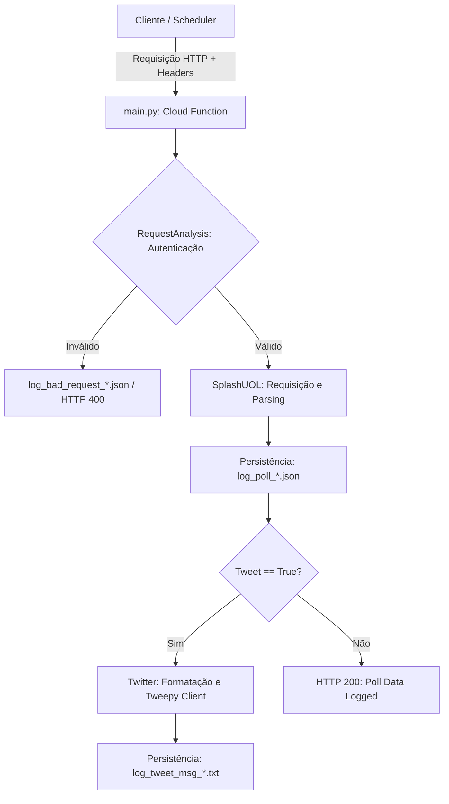

# BBB Polls

<div align="center">

[](https://www.repostatus.org/#deprecated)
[](https://www.python.org/)
[](https://cloud.google.com/functions)
[](https://flask.palletsprojects.com/)
[](https://www.tweepy.org/)
[](https://peps.python.org/pep-0008/)
[](https://google.github.io/styleguide/pyguide.html#38-comments-and-docstrings)
[](LICENSE)

*Extração automatizada de dados parciais de enquetes do reality show Big Brother Brasil (BBB) no portal Splash/UOL com suporte à telemetria e publicação de atualizações.*

[Visão Geral](#visao-geral) •
[Funcionalidades](#funcionalidades) •
[Arquitetura](#arquitetura) •
[Variáveis de Ambiente](#variaveis-de-ambiente) •
[Headers HTTP](#protocolo-de-requisicao-headers-http) •
[Testes](#execucao-e-testes) •
[Status da API do X](#status-e-observacoes-da-api-do-x)

</div>

---

> [!WARNING]
> **PROJETO DESCONTINUADO**
>
> Este repositório encontra-se inativo e não recebe novas atualizações ou correções. O projeto foi descontinuado após o encerramento da temporada do Big Brother Brasil e as mudanças no modelo de precificação da API do X (Twitter). O código é mantido publicamente apenas para fins de documentação, consulta e histórico técnico.

## Visão Geral

O **BBB Polls** é uma solução serverless projetada para operar como uma **Google Cloud Function**. O projeto monitora as votações populares do Big Brother Brasil disponibilizadas pelo portal [Splash (UOL)](https://www.uol.com.br/splash/), realizando a coleta periódica de percentuais, totalização de votos e estruturação dos dados para acompanhamento histórico e publicação de parciais.

## Funcionalidades

- **Scraping e Parsing Estruturado:** Extrai dados de votação diretamente da estrutura embutida nas páginas de enquete do portal Splash/UOL.
- **Autenticação Determinística:** Validação temporal de segurança baseada em identificadores UUID v5 calculados por minuto.
- **Composição de Mensagens:** Formatação de texto para redes sociais com ranking dos mais votados e percentual residual agregado.
- **Logs e Telemetria Local:** Persistência em JSON com identificação temporal no fuso horário `America/Sao_Paulo`.
- **Pipeline de Análise Temporal:** Utilitários para consolidar bancos históricos e gerar dados para visualizações em gráficos animados (*Flourish Bar Chart Race*).

## Arquitetura



### Estrutura de Diretórios

```
bbb-polls/
├── classes/
│   ├── helpers.py            # Utilitários de data/hora e escrita de logs
│   ├── request_analysis.py   # Validação de segurança e análise de headers
│   ├── splash_uol.py         # Extração e parsing HTML das enquetes
│   └── twitter.py            # Formatação e publicação na API do X
├── database/
│   └── polls.json            # Mapeamento de endpoints por temporada
├── log/                      # Diretório de logs brutos em formato JSON
├── tests/
│   ├── create_logs_database.py # Consolidação de arquivos em base JSON única
│   ├── log_join.py           # Agregação cronológica e exportação CSV
│   └── tests.py              # Simulação periódica de requisições HTTP
├── main.py                   # Ponto de entrada da Cloud Function
├── README.md                 # Documentação principal
└── requirements.txt          # Dependências do projeto
```

## Variáveis de Ambiente

Para a execução completa das funcionalidades de autenticação e publicação, as seguintes variáveis de ambiente devem ser configuradas:

| Variável | Descrição |
| :--- | :--- |
| `UUID` | Namespace hexadecimal base para geração determinística do UUID v5. |
| `TWITTER_CONSUMER_KEY` | Consumer Key da aplicação no Developer Portal do X. |
| `TWITTER_CONSUMER_SECRET` | Consumer Secret da aplicação no Developer Portal do X. |
| `TWITTER_ACCESS_TOKEN` | Access Token da conta de publicação no X. |
| `TWITTER_ACCESS_TOKEN_SECRET` | Access Token Secret da conta de publicação no X. |

## Protocolo de Requisição (Headers HTTP)

Toda chamada direcionada ao *entry point* da Cloud Function deve fornecer os seguintes cabeçalhos HTTP:

```http
GET / HTTP/1.1
Host: <cloud-function-url>
Uuid: <uuid-v5-calculado-no-minuto>
Endpoint: /2026/01/15/bbb-26---enquete-uol-quem-voce-quer-eliminar.htm
Tweet: true
Limit: 3
Season: 2026
```

### Detalhamento dos Campos

- **`Uuid`** *(string, obrigatório)*: Identificador único gerado via `uuid.uuid5(UUID, YYYY_MM_DD_HH_MM)`.
- **`Endpoint`** *(string, obrigatório)*: Rota relativa da página da enquete no portal Splash/UOL.
- **`Tweet`** *(string, obrigatório)*: Booleano em formato string (`true` ou `false`).
- **`Limit`** *(string, opcional)*: Quantidade de participantes exibidos no ranking nominal (entre `1` e `4`; padrão: `3`).
- **`Season`** *(string, opcional)*: Ano da edição correspondente.

## Execução e Testes

### Instalação de Dependências

```bash
python3 -m venv venv
source venv/bin/activate
pip install -r requirements.txt
```

### Execução de Testes Locais

Para simular o disparo de requisições periódicas contra o ambiente local:

```bash
python3 tests/tests.py
```

### Consolidação de Dados e Exportação

- Para unificar todos os logs brutos em uma base JSON única:
  ```bash
  python3 tests/create_logs_database.py
  ```
- Para gerar o arquivo CSV de corrida de barras (*Flourish*):
  ```bash
  python3 tests/log_join.py
  ```

## Padrões de Código e Engenharia

- **Estilo de Código:** Aderência estrita às recomendações da [PEP 8](https://peps.python.org/pep-0008/) com limite de 79 caracteres por linha de código e 72 caracteres para docstrings e comentários.
- **Documentação Interna:** Todas as funções, classes e métodos utilizam docstrings no formato [Google Style](https://google.github.io/styleguide/pyguide.html#38-comments-and-docstrings) (PEP 257).

## Status e Observações da API do X

- Conforme documentado na [_Issue_ #22](https://github.com/marcelnishihara/bbb-polls/issues/22), as tentativas de publicação via API passaram a retornar status code `503` (*Service Unavailable*) a partir de março de 2026.
- A alteração decorre da descontinuação do plano gratuito da API do X em favor do modelo *Pay-Per-Use*.
- Em virtude dessa mudança de precificação da plataforma terceira, as postagens automáticas foram pausadas, mantendo a Cloud Function ativa exclusivamente para coleta, parsing e telemetria de dados.
